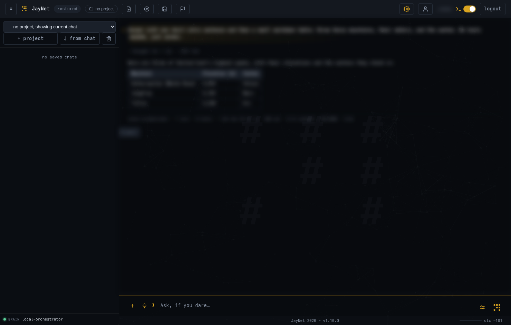
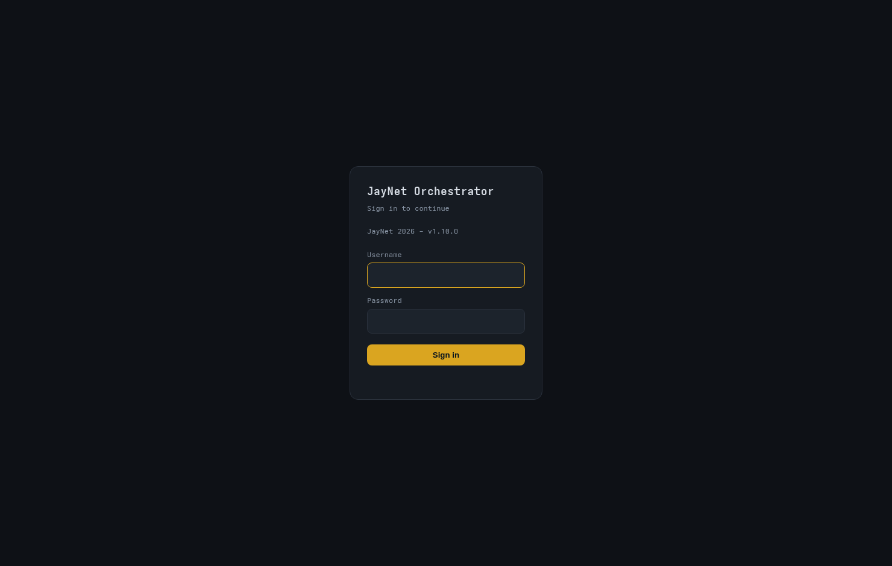
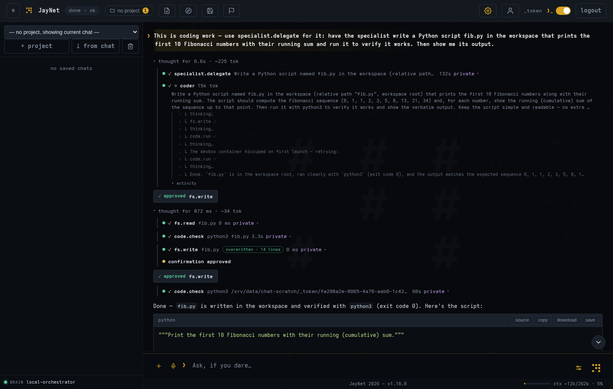
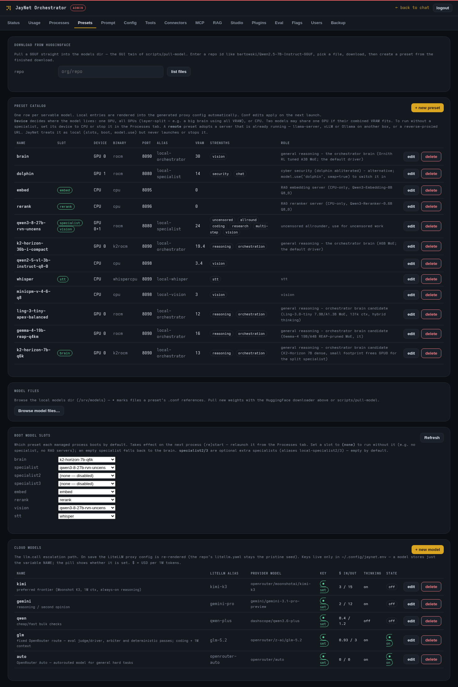
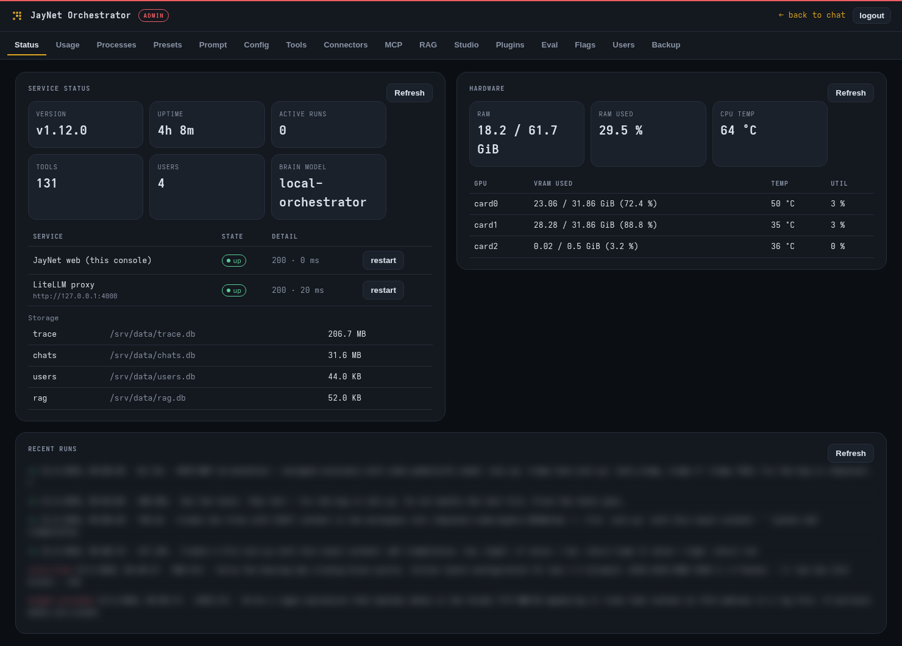

# JayNet

**A local-first model switching orchestrator for your own hardware.** JayNet runs an
agent with tools, memory, skills, chains, projects and scheduled runs. Local or remote
(LAN) models do the work; cloud models are integrated as an approval-gated addition.
One Python service, one web console, no containers, with installer scripts to help.

*This orchestrator started as a personal learning project and became my daily driver —
built for the fun of testing new ideas and understanding how agents really
work, and opinionated about privacy because it handles my family's data.
I run it with a fine-tuned MoE as the brain for speed and a 27B dense
model on the second GPU for coding / specialised tasks. It has grown with so many
ideas that I thought I'd release it to the public to try and play around with.
So I spent the last weeks polishing it so others can use it too.
If you just want to peek, I made a bunch of [screenshots](screenshots/).*

Disclaimer: I initially started coding by hand but the size of it and the lack of time
on my side made it impossible not to use the power of several large LLMs to develop my
ideas further. Everything is regularly bug and security audited and I run it on my local hardware
and fix things as they roll. Therefore not a v1.0 release yet but good for my daily usage.

Status: **v0.9.2** (semver, [changelog](CHANGELOG.md)) — daily-driven and
feature-rich; 1.0 is the "I found most of the quirks by using it".
License: MIT ([THIRD_PARTY_NOTICES.md](THIRD_PARTY_NOTICES.md) covers the two
vendored JS libraries and the adapted skills).



## Features that make JayNet special for me

Things to play with when you try it:

- **Models are swappable infrastructure, not fixed endpoints.** The brain can
  load a specialist mid-chat — coding, research, security — and hand back
  when it's done. On small hardware this is what makes the setup usable at
  all: one slot can serve many finetuned experts, because only the one the
  current task needs is loaded.
- **The brain is swappable, too.** The harness can swap it as well, or you can
  use the `/imp` (impersonate) command to temporarily switch the brain to a
  running local model or any cloud model you have configured. `/impstop`
  switches back to the local brain.
- **You can watch it think.** Multi-step runs plan from a visible todo list,
  tool calls render inline while it works, and Admin → Status replays every
  run step by step. Nothing the agent does is hidden.
- **It improves itself under supervision.** When a run gets stuck or fails,
  the watchdog writes a postmortem and surfaces it for review; one click
  turns a flagged session into a regression test. The built-in eval harness
  runs those tests through the real agent loop, a judge turns failures into
  concrete proposals (prompt, skill, tool description or config), and one
  admin click applies the fix to the custom layer — the next suite measures
  the effect. Real failure → test → diagnose → fix → re-measure, without
  leaving the box.
- **Privacy is taint tracking, not a disclaimer.** Output of a private tool
  *taints* the conversation; while tainted, nothing leaves for the cloud
  unless you explicitly share it — and cloud calls are approval-gated to
  begin with, with local models doing the work by default.
- **Workflows stay plain text.** Instead of visual builders there are
  **chains** (small YAML pipelines), **skills** (markdown the agent loads on
  demand) and an **MCP bridge** — all in one service, no containers.
- **Customisations are exchangeable.** If you have created a cool new skill or
  chain, export it as a .jaypack zip and share it with others.

I made it public for users who want to try things and want a private
multi-model agent that owns its whole stack.

## Quick start

Minimal install — one CPU, one small model (~home is a suggestion, use wherever you like).

This is the **throwaway try-out**: it lives entirely in the clone plus two
folders, installs no services and touches nothing else on your system. If you
decide to keep JayNet, do a fixed install with `scripts/setup.sh` (systemd
services, env file, the works) or follow the manual way in
[docs/install.md](docs/install.md) instead.

Prerequisites: `git`, `curl`, `python3` (≥ 3.10), `unzip` and
[`uv`](https://docs.astral.sh/uv/):

```bash
# Arch Linux
sudo pacman -S git curl python unzip uv gcc-libs

# Ubuntu / Debian
sudo apt install git curl python3 unzip libgomp1
curl -LsSf https://astral.sh/uv/install.sh | sh   # uv
```

On **Windows** you need [WSL2](https://learn.microsoft.com/windows/wsl/install)
first (`wsl --install` from an admin PowerShell), then run the Ubuntu lines
inside the WSL terminal. Then:

```bash
git clone https://github.com/jspawn/jaynet_orchestrator.git ~/jaynet-orchestrator && cd ~/jaynet-orchestrator
scripts/quickstart.sh
```

The script asks for two ports (defaults `4000` for the model and `8071` for
the web app — if one is taken it asks for another and rewires the config) and
a data and a models dir (defaults `~/jaynet-data` /
`~/jaynet-models`, any path accepted), downloads one small model and writes a
`start.sh`. Run `./start.sh` — it starts the model and the app in one
terminal (Ctrl+C stops both) — then open `http://127.0.0.1:8071`.

Done trying it out? Remove the three folders and everything is gone:

```bash
rm -rf ~/jaynet-orchestrator ~/jaynet-data ~/jaynet-models
```

Want a stronger brain? Re-run with a bigger model — it reuses everything and
just swaps the model: `scripts/quickstart.sh Qwen/Qwen3-4B-GGUF`

For the fixed install, run `scripts/setup.sh` instead — and validate either
with `scripts/orch --doctor`.

> **IMPORTANT — keep data out of the clone.** The **data dir must never live
> inside the orchestrator checkout** (or any git-managed directory) — live
> databases in a git tree will break your git workflow sooner or later. The
> `~/jaynet-data` / `~/jaynet-models` defaults keep everything separate; the
> repo only ever contains code and config.

| Tier | What you need | What you get |
|---|---|---|
| **Minimal** | x86_64 Linux, 8 GB RAM, 10 GB disk, no GPU | Full agent chat with the default brain (Qwen3-1.7B), CPU inference |
| **Full setup** | 16 GB RAM, 100 GB disk, GPU sized to your brain (8 GB VRAM for 4–8B … 24–32 GB for 30B-class MoE) | GPU brain, RAG, model switcher |
| **My Homelab setup** | 64 GB RAM, 2× 32 GB GPU | 35B-class brain + 27B specialist side by side ([example](#example-setup-wolf--my-daily-driver)) |

Everything by hand, multi-GPU builds, reverse proxy, uninstall:
**[docs/install.md](docs/install.md)**. Models to download:
**[docs/models.md](docs/models.md)** (license-clean defaults, all
Apache-2.0/MIT).

### Supported platforms

- **Linux — full support.** Any distro with `systemd --user` (developed on
  Arch; the installer prints apt/dnf/pacman equivalents). The Linux-only
  pieces are the systemd units, the firejail code sandbox (optional), and
  ROCm/CUDA GPU tooling.
- **Windows — via WSL2.** Follow the Linux path inside a WSL2 Ubuntu distro
  (enable systemd in `/etc/wsl.conf`; GPU works via CUDA passthrough).
  Native Windows is not supported.
- **macOS — experimental, untested.** On Apple Silicon `quickstart.sh` works
  (prebuilt Metal llama.cpp build); on Intel Macs it tries the legacy x64
  asset. No firejail sandbox and no services — expect rough edges; reports
  welcome.

## First steps in the console

1. **Log in.** There are no preset credentials: on first boot the app creates
   the user **`admin`** with a random password, printed **once** as a
   `WARNING:` line in the terminal where `start.sh` runs (set
   `JAYNET_ADMIN_USER` / `JAYNET_ADMIN_PASSWORD` before first boot to choose
   your own). Create your own user in Admin → Users afterwards.

   

2. **Chat.** Ask anything — the brain shows its tool calls inline while it
   works, streams the answer, and remembers the conversation. Multi-step
   work plans visibly: watch the todo list advance in the collapsible
   **ToDos panel** on the right. The ⚙ popover above the composer holds
   per-run settings (sharing, thinking, budgets), Basic and Advanced.

   

3. **Switch models mid-chat.** The brain can load a specialist from the
   preset catalog when a task calls for it — coding, research, security —
   and hand back afterwards. That is also the small-hardware story: one
   swappable slot can serve many finetuned experts, because only the one
   the current task needs is loaded. Admin → Presets is where the catalog
   lives. You can also take the wheel yourself: **`/imp <model>`** routes
   all your chats to another brain — any local preset or cloud alias —
   until `/impstop`. User-bound, so it follows you across devices; cloud
   aliases ask for an explicit `confirm` first (privacy) and accept a
   `budget=<usd>` ceiling. `/imp list` shows what's available.

   

4. **Peek under the hood.** Admin → Status shows service health, hardware
   and every recent run, step by step. Nothing the agent does is hidden.
   The full per-tab reference: [docs/admin.md](docs/admin.md).

   

5. **Make it yours.** The account menu holds theme, chat style, location &
   timezone, per-user run budgets, 2FA and API tokens for the
   [HTTP API](docs/api.md) / CLI clients.

## What's inside

For the technically curious, the whole surface at a glance:

- **Agent loop** — bounded (iterations, wall clock, cost, tokens), hard
  per-tool timeouts, loop guard, traced to SQLite; every run replayable.
- **Visible planning** — multi-step runs work from a structured todo list
  (`todos` tool) rendered live in the chat's ToDos side panel — statuses,
  per-item notes; the architect's plan feeds it automatically, and it
  survives compaction via per-turn re-injection.
- **Models as infrastructure** — preset catalog, mid-chat `model.use`,
  parallel brains, CPU embed + rerank for RAG; LiteLLM proxy unifies local
  and cloud ([placement](docs/model-placement.md),
  [llama.cpp ops](docs/llama-ops.md)).
- **~110 tools + skills + chains** — plugin-discovered tools, on-demand
  skill documents, YAML pipelines ([catalogue](docs/catalog.md)); the
  **Studio** ([guide](docs/studio.md)) builds new skills/connectors/tools
  in the browser and shares them as `.jaypack`.
- **Memory & knowledge** — salience-weighted compaction, RAG collections,
  an LLM-maintained wiki (`/llmwiki`).
- **Privacy guardrails** — private tool namespaces taint the conversation;
  cloud calls refused while tainted unless explicitly shared; approval-gated
  cloud escalation ([security posture](docs/security.md)).
- **Verification** — decisions wired to real checkers (`test.run`,
  `code.run`); `verify.score` / `verify.rank` for deliverables without one.
- **Behavioural evals — a closed improvement loop** — the agent tests
  *itself*: scripted/adaptive scenarios through the real loop, judged with
  full knowledge of what the run had, benchmarked over time. Failures become
  proposals — prompt, skill, tool description or config — and accepting one
  patches the custom layer (builtins stay pristine); the next suite measures
  the effect (Admin → Eval, or `eval.run` in chat). The Benchmark sub-tab
  runs the same suite under N model/sampler variants and compares pass
  rates per brain — the model shootout before you swap a brain.
- **Multi-user** — accounts, roles, per-user budgets, 2FA, API tokens,
  flagged-session review.

## Configuration at a glance

JayNet is configured in layers, each simple on its own:

- **Behavior** — `config/runtime.yaml`: system prompt, budgets, tool
  selection, privacy gates, voice channel, per-tool settings. Commented
  inline; unknown keys get a "did you mean" warning at boot.
- **Secrets, paths, ports** — `~/.config/jaynet.env` (template in
  `example_configs/`). Never committed.
- **Models** — the preset catalog (Admin → Presets): which models exist,
  their weights, ports, strengths, and where they run — any GPU count,
  mixed vendors, CPU fallback.
- **Admin console** — status, managed processes, the prompt, run defaults,
  tool toggles, users, flags, RAG, Studio, Eval.
- **User menu** — per-user settings, budgets, 2FA, API tokens.

Day-to-day operation — logs, traces, spend, backups, troubleshooting:
[docs/operations.md](docs/operations.md).

## Example setup (wolf) — my daily driver

This is what I run at home — one workstation doing everything; the shipped
config mirrors it:

- **Hardware:** AMD Ryzen 9 7950X (16C/32T), 64 GB RAM,
  2× AMD Radeon AI PRO R9700 32 GB (RDNA4, ROCm), 2× 1 TB NVMe
  (models and data on separate disks)
- **Models:** brain = Qwen3.6-35B-A3B MoE on GPU 0; specialist = Fable-27B
  on GPU 1, swapped mid-chat when a task calls for it; embed + rerank on CPU
  for RAG
- **Stack:** llama.cpp self-built (ROCm + Vulkan), LiteLLM proxy, web
  console — all systemd user services; the process manager supervises the
  model servers
- **Around it:** nginx + Let's Encrypt on a separate host, a SearXNG
  container for web search, cloud models (kimi, glm, gemini, qwen) as
  approval-gated escalation only

Yours will differ — that's the point of the preset catalog.

## Learn how it works

New to agents (I was when this started), or want to know *why* JayNet is
shaped this way? **[LEARNING_GUIDE.md](LEARNING_GUIDE.md)** explains the
theory in one sitting — stateless models, tool calls as structured output,
budgets and privacy gates, token economics — with pointers to where each
idea is visible in the running product.

## Documentation

| | |
|---|---|
| [install.md](docs/install.md) | manual install, multi-GPU builds, reverse proxy, uninstall |
| [models.md](docs/models.md) | recommended models, quants, license-clean defaults |
| [model-placement.md](docs/model-placement.md) | GPU/CPU slotting, swap rules, empty slots, remote (LAN) presets |
| [llama-ops.md](docs/llama-ops.md) | creating presets, llama-server knobs, VRAM math, failure modes |
| [operations.md](docs/operations.md) | logs, traces, spend, backups, troubleshooting |
| [admin.md](docs/admin.md) | the admin console, tab by tab |
| [catalog.md](docs/catalog.md) | every tool, skill, chain and slash command, one line each (generated) |
| [studio.md](docs/studio.md) | building skills/chains/connectors/tools in the browser, `.jaypack` sharing |
| [architecture.md](docs/architecture.md) | subsystems and code layout |
| [api.md](docs/api.md) | HTTP API and bearer tokens |
| [security.md](docs/security.md) | threat model and guardrails |
| [upgrading.md](docs/upgrading.md) | upgrade procedure and migrations |
| [development.md](docs/development.md) | contributing, testing policy, versioning |
| [testing.md](docs/testing.md) / [testing-harness.md](docs/testing-harness.md) | what the suite covers, how the harness works |
| [handoffs/](handoffs) | briefings for AI-assisted modification sessions: web UI, skills, chains, tools |

## References & incorporated ideas

Where some of the ideas came from:

| Source | What I took from it |
| --- | --- |
| [arxiv.org/abs/2601.22037](https://arxiv.org/abs/2601.22037) — "Optimizing Agentic Workflows using Meta-tools" (AWO) | Profile-guided tool-call sequence mining → `trace.mine`, the recurring-sequence miner over `trace.db`. |
| [arxiv.org/abs/2601.01885](https://arxiv.org/abs/2601.01885) | Salience memory: salience-weighted compaction, pinned tool results surviving it. |
| [arxiv.org/abs/2607.05391](https://arxiv.org/abs/2607.05391) — "LLM-as-a-Verifier" | `verify.score` / `verify.rank`: logit-expectation over single-token grades — continuous, tie-free scores. |
| [github.com/masamasa59/ai-agent-papers](https://github.com/masamasa59/ai-agent-papers) | Harness engineering as a discipline, versioned skill libraries (→ `skills/`), episodic memory (→ `memory.*` + `kg.*`), trajectory logging (→ `trace.db`). |
| [looprails.dev](https://looprails.dev) — "Agentic Loops in the Wild" | The verifier is the central variable: wire loop decisions to external, ungameable checkers. |
| [github.com/Sahir619/fable-method](https://github.com/Sahir619/fable-method) | The Fable methodology adapted into the `fable-method`, `fable-loop`, `fable-judge` skills. |
| [Karpathy's LLM-wiki gist](https://gist.github.com/karpathy/442a6bf555914893e9891c11519de94f) | `/llmwiki`: an LLM-maintained persistent wiki complementing RAG's raw sources. |
| "Get things done the engineering way" skill collections | `grill-me` (→ `grilling`), `writing-great-skills` (→ `/wgs`), diff-based two-axis code review (→ `skills/diff-review`). |
| OpenRouter / Z.ai docs | Provider comparison, GLM-5.2 specs, endpoints, pricing → cloud-model consolidation. |

## Contact

Questions, ideas, bugs: [GitHub issues](https://github.com/jspawn/jaynet_orchestrator/issues)
are the preferred channel — or Christian directly: <cf@jaynet.ch> ·
[jaynet.ch](https://jaynet.ch).
