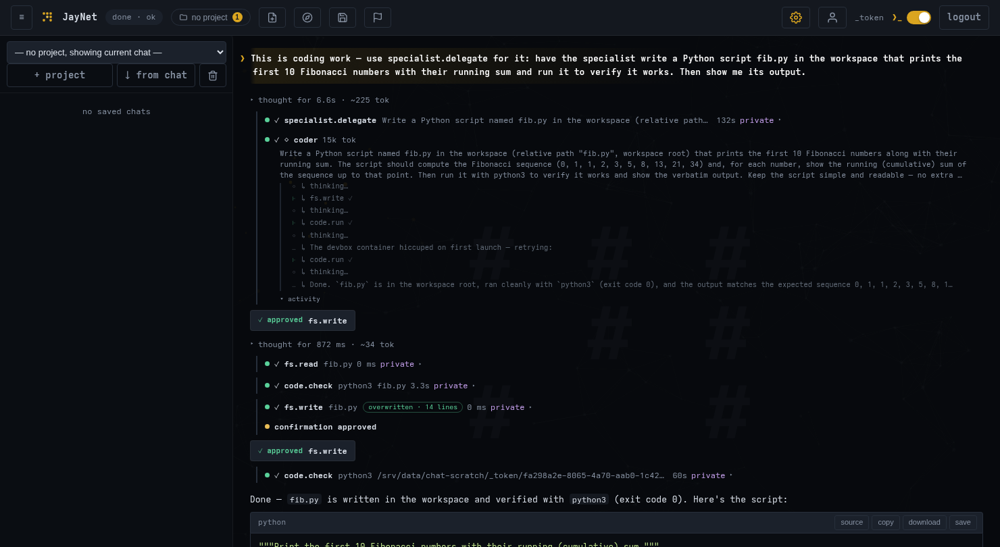
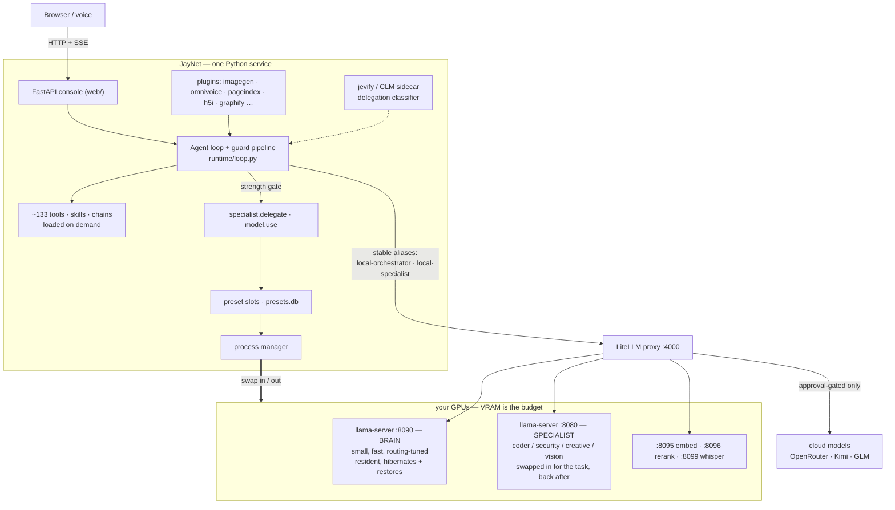
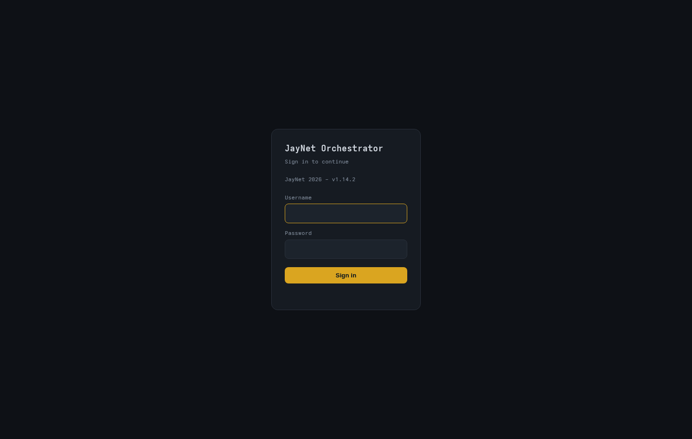
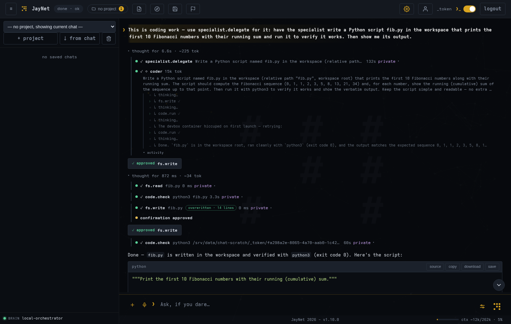
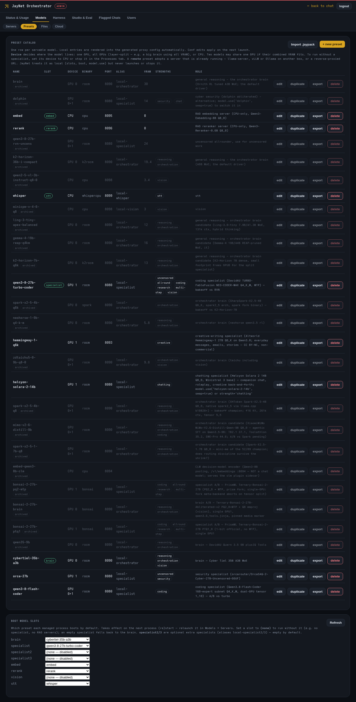
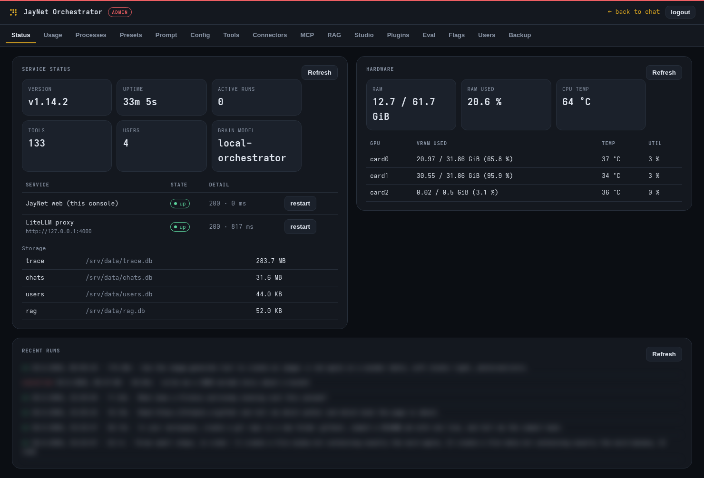

# JayNet

**JayNet is a personal AI assistant that runs on your own hardware.** It chats,
searches and reads the web, writes and tests code, works with your files and
documents, remembers what you tell it, generates images, speaks text aloud,
and runs scheduled
jobs — all with local models on your own GPUs. Its key idea: a small, fast
"brain" model stays loaded and runs every conversation, and when a task needs
more muscle — coding, security analysis, vision, image generation, text-to-speech — JayNet
swaps the matching specialist model onto the GPU, lets it do that piece of
work, and swaps back. One box behaves like a team of models instead of one
compromise model that is mediocre at everything. Cloud models exist only as an
approval-gated option. One Python service, one web console — your data stays
on your box unless you say otherwise.

*This orchestrator started as a personal learning project and became my daily driver —
built for the fun of testing new ideas and understanding how agents really
work, and opinionated about privacy because it handles my family's data.
I run it with a routing-trained 35B-class MoE (~3B active
params at ~106 tok/s, vision included) as the brain and a 27B dense model
tensor-split across both GPUs
for coding / specialised tasks (the exact setup:
[docs/my-setup.md](docs/my-setup.md)) — the brain was picked by a fourteen-candidate
eval bakeoff, not by vibes (see below; the MoE took the crown at 38/41 with
a perfect 10/10 terminal-bench half). It has grown with so many
ideas that I thought I'd release it to the public to try and play around with.
So I spent the last weeks polishing it so others can use it too.
If you just want to peek, I made a bunch of [screenshots](screenshots/).*

Disclaimer: I initially started coding by hand but the size of it and the lack of time
on my side made it impossible not to use the power of several large LLMs to develop my
ideas further. Everything is regularly bug and security audited and I run it on my local hardware
and fix things as they roll — it has been my daily driver for months.

Status: **v1.20.5** (semver, [changelog](CHANGELOG.md)) — daily-driven and
feature-rich; most quirks were found by using it.
License: MIT ([THIRD_PARTY_NOTICES.md](THIRD_PARTY_NOTICES.md) covers the two
vendored JS libraries and the adapted skills).



## How it works

One Python service, one proxy, and models that swap in and out of your GPUs
as the task demands — the loop only ever talks to **stable aliases**, so a
swap is invisible to the conversation:


```mermaid
flowchart TB
    U["Browser / voice"] -->|"HTTP + SSE"| WEB["FastAPI console (web/)"]
    subgraph JN["JayNet — one Python service"]
        WEB --> LOOP["Agent loop + guard pipeline<br/>runtime/loop.py"]
        LOOP --> TOOLS["~133 tools · skills · chains<br/>loaded on demand"]
        PLUG["plugins: imagegen · omnivoice · pageindex · h5i · graphify …"] --> LOOP
        JEV["jevify / CLM sidecar<br/>delegation classifier"] -.-> LOOP
        LOOP -->|"strength gate"| DEL["specialist.delegate · model.use"]
        DEL --> SLOTS["preset slots · presets.db"]
        SLOTS --> PM["process manager"]
    end
    LOOP -->|"stable aliases:<br/>local-orchestrator · local-specialist"| LL["LiteLLM proxy :4000"]
    subgraph GPUs["your GPUs — VRAM is the budget"]
        BRAIN["llama-server :8090 — BRAIN<br/>small, fast, routing-tuned<br/>resident, hibernates + restores"]
        SPEC["llama-server :8080 — SPECIALIST<br/>coder / security / creative / vision<br/>swapped in for the task, back after"]
        AUX[":8095 embed · :8096 rerank · :8099 whisper"]
    end
    PM ==>|"swap in / out"| GPUs
    LL --> BRAIN
    LL --> SPEC
    LL --> AUX
    LL -->|"approval-gated only"| CLOUD["cloud models<br/>OpenRouter · Kimi · GLM"]
```

The brain stays loaded and runs every conversation. When a task needs more
muscle, the strength gate routes it to `specialist.delegate`, the preset
store decides which model occupies the slot, and the process manager swaps
the llama-server underneath the alias — then swaps back when the work is
done. Swaps are scheduled by **measured fit, not guesses**: `model.measure`
records each preset's real per-GPU VRAM + RAM footprint (hibernate the box,
load, probe, write it into the preset), and the loader then lets models
**share a card when the numbers fit** — a specialist at 50% of a GPU no
longer blocks a second model that fits the rest. Eviction only happens on
a genuine shortfall or a port conflict, and the brain itself can hibernate
for a swap or a big image generation — it's always restored, with a
readiness wait, before its next turn. Where each piece lives in code:
[docs/code-map.md](docs/code-map.md).

## Features that make JayNet special for me

Things to play with when you try it:

- **Models are swappable infrastructure, not fixed endpoints.** The brain can
  load a specialist model mid-chat onto any GPU/CPU configured — coding,
  research, security — and hand back when it's done. On small hardware this is
  what makes the setup usable at all: e.g. one GPU slot can serve many
  finetuned experts, because only the one the current task needs is loaded.
  Skills can trigger the model swap and swap back when finished. And the
  scheduler knows what fits: each preset carries its measured per-GPU
  footprint (`model.measure` writes it), so models co-load on a card whenever
  the real numbers allow — eviction is the fallback, not the default. For me
  it's the Qwen3.8-27B Turbo coder for `specialist.delegate` (vision included
  via its mmproj — no separate vision slot) and Dolphin-3.0-8B for security.
- **The brain is swappable, too.** The harness can swap it as well, or you can
  use the `/imp` (impersonate) command to temporarily switch the brain to a
  running local model or any cloud model you have configured. `/impstop`
  switches back to the local brain.
- **The brain is chosen by measurement, not vibes.** Fourteen brain
  candidates — 35B MoEs down to a 1.7B, dense, MoE, ternary — ran the same
  hard-tail eval suite through the *real* agent loop, and the table picked
  the brain: [docs/brain-bakeoff.md](docs/brain-bakeoff.md). What the search
  taught: a small routing-tuned brain + a strong specialist beats a big
  brain that hogs the wheel; delegation count is a better brain-health
  metric than pass rate; speed is a feature only while the pass column
  holds (the 80 t/s candidate lost to a 32 t/s one, 26 vs 32 points); and
  harness rails move behavior that weights don't — when small brains
  ignored every "please delegate" gate, the loop guard learned to **run
  the delegation itself** (auto-delegate), and a finished delegation now
  gets **reviewed fresh-context by the strongest available model**, never
  by the brain that ordered it. My current driver came out of that table:
  a routing-trained 35B-class MoE (~3B active params,
  ~106 tok/s, vision included — exact model and box in
  [docs/my-setup.md](docs/my-setup.md)) that delegates 81% of the time
  voluntarily, which is exactly what leaves room for the split specialist
  beside it.
- **You can watch it think.** Multi-step runs plan from a visible todo list,
  tool calls render inline while it works, a delegated specialist narrates
  its progress live under the `◇ coder` row (route, model swap, tool steps),
  and Admin → Status & Usage → Recent runs replays every run step by step. Finished responses carry
  ✎ edit / ↻ retry buttons, typing while a run is live queues the message as
  a chip instead of interrupting, and background jobs announce their
  completion in the chat. Nothing the agent does is hidden.
- **Hard tasks earn working discipline.** The shipped `j-space` skill makes
  the loop classify a task first (fast / full / loop), load only the
  doctrine that task earns, plan before editing, and keep a ledger of what
  is settled on long work — and the active mode shows as a live badge on
  the run, so you see the moment it decides a task deserves the long path.
- **Huge documents never enter the context window.** The RLM pattern is
  native: a 450 KB log stays a workspace file, the agent slices it
  programmatically, maps mediated sub-LLM calls over the slices
  (`llm_query` from inside a `code.run` python snippet — budgeted, taint-gated to local
  models, traced), and reduces the results itself. Exact answers from
  bulk, without compaction loss or a second unmediated agent loop.
- **Real toolchains in throwaway containers.** The firejail sandbox only has
  what the host has, so "compile this Rust" or "build this .NET solution"
  used to fail there. Opt in once (`scripts/devbox-build.sh`, then
  `tools.code.devbox.enabled`) and `code.run` executes inside a per-run
  rootless podman container with Rust, Go, Node, C/C++, Java and .NET 8 + 10
  preinstalled — dependency caches persist on shared volumes, and the
  container's network is cut automatically the moment a run touches private
  data. Without it, the firejail sandbox remains the default.
- **It improves itself under supervision.** When a run gets stuck or fails,
  the watchdog writes a postmortem and surfaces it for review; one click
  turns a flagged session into a regression test. The built-in eval harness
  runs those tests through the real agent loop, a judge turns failures into
  concrete proposals (prompt, skill, tool description or config), and one
  admin click applies the fix to the custom layer — the next suite measures
  the effect. Real failure → test → diagnose → fix → re-measure, without
  leaving the box.
- **Privacy is taint tracking, not a disclaimer.** Output of a private tool
  *taints* the conversation; while tainted, nothing leaves for the cloud
  unless you explicitly share it — and cloud calls are approval-gated to
  begin with, with local models doing the work by default.
- **Workflows stay plain text.** Instead of visual builders there are
  **chains** (small YAML pipelines), **skills** (markdown the agent loads on
  demand) and an **MCP bridge** — all in one service, no containers.
- **Customisations are exchangeable.** If you have created a cool new skill or
  chain, export it as a .jaypack zip and share it with others.
- **Capabilities are opt-in plugins.** Anything beyond the core — like the
  shipped graphify plugin, which maps each project into a queryable graph the
  agent queries instead of grepping files, benchlab, which imports public
  agent benchmarks (Terminal-Bench, GAIA) as eval cases, imagegen (local
  text-to-image — Qwen-Image on stable-diffusion.cpp; hibernates the
  configured slots for the VRAM while it draws, brain included when a big
  image needs both GPUs, and restores them with a readiness wait), omnivoice (local
  text-to-speech with voice design and cloning — OmniVoice on omnivoice.cpp),
  pageindex (vectorless tree index for long PDFs — the agent navigates
  structure and page ranges instead of similarity chunks), or clm (a contrastive
  decision model for judging and ranking) — ships as a
  disabled-by-default plugin you enable in Admin → Harness → Plugins. Toggling applies
  live: enable registers the plugin's tools, hooks, routes and skills into
  the running service, disable removes exactly those (only new pip
  dependencies need a restart). Broken or unwanted plugins still can't take
  JayNet down: disabled means never imported.- **Terminal soul, your call.** I love the CLI look, so the web chat wears it —
  one click in the user menu switches to chat bubbles, and the
  [web-UI handoff](handoffs/web-ui.md) lets you build your own look and feel.
  If there's demand, I might add a template feature.

I made it public for users who want to try things and want a private
multi-model agent that owns its whole stack.

## Quick start

Minimal install — one CPU, one small model (~home is a suggestion, use wherever you like).
For a **permanent installation** use `scripts/setup.sh` ([guided install
guide](docs/setup_installation.md)) or the [manual
process](docs/manual_installation.md) instead.

This is the **throwaway try-out**: it lives entirely in the clone plus two
folders, installs no services and touches nothing else on your system.

Prerequisites: `git`, `curl`, `python3` (≥ 3.11), `unzip` and
[`uv`](https://docs.astral.sh/uv/):

```bash
# Arch Linux
sudo pacman -S git curl python unzip uv gcc-libs

# Ubuntu / Debian
sudo apt install git curl python3 unzip libgomp1
curl -LsSf https://astral.sh/uv/install.sh | sh   # uv
```

On **Windows** you need [WSL2](https://learn.microsoft.com/windows/wsl/install)
first (`wsl --install` from an admin PowerShell), then run the Ubuntu lines
inside the WSL terminal. Then:

```bash
git clone https://github.com/jspawn/jaynet_orchestrator.git ~/jaynet-orchestrator && cd ~/jaynet-orchestrator
scripts/quickstart.sh
```

The script asks for two ports (defaults `4000` for the model and `8071` for
the web app — if one is taken it asks for another and rewires the config) and
a data and a models dir (defaults `~/jaynet-data` /
`~/jaynet-models`, any path accepted), downloads one small model and writes a
`start.sh`. Run `./start.sh` — it starts the model and the app in one
terminal (Ctrl+C stops both) — then open `http://127.0.0.1:8071`.

Done trying it out? Remove the three folders and everything is gone:

```bash
rm -rf ~/jaynet-orchestrator ~/jaynet-data ~/jaynet-models
```

Want a stronger brain? Re-run with a bigger model — it reuses everything and
just swaps the model: `scripts/quickstart.sh Qwen/Qwen3-4B-GGUF`

For the fixed install, run `scripts/setup.sh` instead — and validate either
with `scripts/orch --doctor`.

> **IMPORTANT — keep data out of the clone.** The **data dir must never live
> inside the orchestrator checkout** (or any git-managed directory) — live
> databases in a git tree will break your git workflow sooner or later. The
> `~/jaynet-data` / `~/jaynet-models` defaults keep everything separate; the
> repo only ever contains code and config.

| Tier | What you need | What you get |
|---|---|---|
| **Minimal** | x86_64 Linux, 8 GB RAM, 10 GB disk, no GPU | Full agent chat with the default brain (Qwen3-1.7B), CPU inference |
| **Full setup** | 16 GB RAM, 100 GB disk, GPU sized to your brain (8 GB VRAM for 4–8B … 24–32 GB for 30B-class MoE) | GPU brain, RAG, model switcher |
| **My Homelab setup** | 64 GB RAM, 2× 32 GB GPU | 35B-class brain + 27B specialist side by side ([example](docs/my-setup.md)) |

Permanent install with the guided installer:
**[docs/setup_installation.md](docs/setup_installation.md)** — everything by
hand, multi-GPU builds, reverse proxy, uninstall:
**[docs/manual_installation.md](docs/manual_installation.md)**. Models to
download: **[docs/models.md](docs/models.md)** (license-clean defaults, all
Apache-2.0/MIT).

### Supported platforms

- **Linux — full support.** Any distro with `systemd --user` (developed on
  Arch; the installer prints apt/dnf/pacman equivalents). The Linux-only
  pieces are the systemd units, the firejail code sandbox (optional, or the
  podman devbox), and ROCm/CUDA GPU tooling.
- **Windows — via WSL2.** Follow the Linux path inside a WSL2 Ubuntu distro
  (enable systemd in `/etc/wsl.conf`; GPU works via CUDA passthrough).
  Native Windows is not supported.
- **macOS — experimental, untested.** On Apple Silicon `quickstart.sh` works
  (prebuilt Metal llama.cpp build); on Intel Macs it tries the legacy x64
  asset. No firejail sandbox and no services — expect rough edges; reports
  welcome.

## First steps in the console

1. **Log in.** There are no preset credentials: on first boot the app creates
   the user **`admin`** with a random password, printed **once** as a
   `WARNING:` line in the terminal where `start.sh` runs (set
   `JAYNET_ADMIN_USER` / `JAYNET_ADMIN_PASSWORD` before first boot to choose
   your own). Create your own user in Admin → Users afterwards.

   

2. **Chat.** Ask anything — the brain shows its tool calls inline while it
   works, streams the answer, and remembers the conversation. Multi-step
   work plans visibly: watch the todo list advance in the collapsible
   **ToDos panel** on the right. The ⚙ popover above the composer holds
   per-run settings (sharing, thinking, budgets), Basic and Advanced.

   

3. **Switch models mid-chat.** The brain can load a specialist from the
   preset catalog when a task calls for it — coding, research, security —
   and hand back afterwards. That is also the small-hardware story: one
   swappable slot can serve many finetuned experts, because only the one
   the current task needs is loaded. Admin → Models → Presets is where the catalog
   lives. You can also take the wheel yourself: **`/imp <model>`** routes
   all your chats to another brain — any local preset or cloud alias —
   until `/impstop`. User-bound, so it follows you across devices; cloud
   aliases ask for an explicit `confirm` first (privacy) and accept a
   `budget=<usd>` ceiling. `/imp list` shows what's available.

   

4. **Peek under the hood.** Admin → Status & Usage shows service health and
   hardware (Overview) and every recent run, step by step (Recent runs).
   Nothing the agent does is hidden.
   The full per-tab reference: [docs/admin.md](docs/admin.md).

   

5. **Make it yours.** The account menu holds theme, chat style, location &
   timezone, per-user run budgets, 2FA and API tokens for the
   [HTTP API](docs/api.md) / CLI clients.

## What's inside

For the technically curious, the whole surface at a glance:

- **Agent loop** — bounded (iterations, wall clock, cost, tokens), hard
  per-tool timeouts, loop guard, traced to SQLite; every run replayable.
  And it *enforces* its doctrine instead of asking: a routing nudge steers
  coding/security work to `specialist.delegate` (a live strength gate rejects
  inline edits until it happens, and with a coding specialist present the
  brain's own coding tools are swapped for a verify-only `code.check`),
  explicit output requirements (`[must]` items, `/goal`'s done-criterion, an
  accuracy demand like "be exact") bounce premature final answers until
  verified, a stall ladder escalates on frozen
  turns, a brain that ignores even the hard rejections gets the task
  **delegated for it** (`loop_guard.auto_delegate_after` — enforcement
  beats entreaty, measured), finished delegations are **reviewed
  fresh-context by the strongest available model** (never the brain),
  a deliverable check bounces final answers that never wrote the
  named file, and **procedures** — shape-tagged skills distilled from
  frontier-model process — auto-load on a confident match with their
  `checkpoints:` nudged against before the answer is accepted.
- **Visible planning** — multi-step runs work from a structured todo list
  (`todos` tool) rendered live in the chat's ToDos side panel — statuses,
  per-item notes; the architect's plan feeds it automatically, and it
  survives compaction via per-turn re-injection. A one-line budget readout
  (`budget: iteration N/M`) rides the same slot every turn, so the model
  paces itself against a limit it can see instead of hitting an invisible
  wall.
- **Goals & loops** — `/goal` pursues an objective across runs until its
  done-criterion holds; `/loop` is the fresh-context sibling (the "Ralph"
  pattern): every iteration starts with an *empty* context window, STATE.md
  in the workspace carries the memory, and an optional `| check:` command
  gates completion deterministically instead of a model judge. New here?
  The compass-button **guided start** asks two questions and routes you to
  chat, `/loop`, `/goal`, or a new project.
- **Connectors** — declarative, shareable bridges to external systems
  (Gmail-style APIs, a LAN mail server, an ERP): YAML, no code, so
  importing one can't execute anything. Admin → Harness → Integrations toggles them
  hot, sets read-only/read-write per connector (write tools vanish in RO),
  and holds per-box settings — a `.jayconn` pack never carries secrets
  ([authoring guide](handoffs/connectors.md)).
- **Models as infrastructure** — preset catalog, mid-chat `model.use`,
  parallel brains, CPU embed + rerank for RAG, plus optional CPU helper
  slots for **vision** (a llama-server with `--mmproj`, used by
  `llm.call images=[...]`) and **speech-to-text** (a whisper.cpp server —
  `audio.transcribe` for the agent, a mic button in the composer for you;
  both slots ship empty and the UI stays hidden until assigned). The other
  direction — **text-to-speech** with voice design (a fixed vocabulary of
  gender/age/pitch/whisper/accent items) and
  voice cloning — is the omnivoice plugin (`audio.speak`/`audio.clone`,
  OmniVoice on omnivoice.cpp; pair it with the `read-aloud` chain for
  expressive, voice-tagged readings). LiteLLM
  proxy unifies local
  and cloud. llama.cpp is the native runtime (JayNet launches and places it
  for you), but a server you already have running — vLLM, Ollama, another
  llama.cpp box on the LAN — can be adopted as a *remote preset* and used
  like a local model ([placement](docs/model-placement.md),
  [llama.cpp ops](docs/llama-ops.md), [adopted servers](docs/models.md#adopt-existing-server)).
- **115 tools (+21 plugin tools) + skills + chains** — plugin-discovered tools, on-demand
  skill documents, YAML pipelines ([catalogue](docs/catalog.md), narrative
  [playbook](docs/playbook.md)); the
  **Studio** ([guide](docs/studio.md)) builds new skills/connectors/tools
  in the browser and shares them as `.jaypack`.
- **Memory & knowledge** — salience-weighted compaction, RAG collections,
  an LLM-maintained wiki (`/llmwiki`), and a `/charter` interview that seeds
  a new project's wiki before any code exists. The surfaces talk: graphify
  turns wiki pages into project-graph nodes, `graph.seed_kg` seeds a project
  graph into the curated knowledge graph, and project-bound `rag.search`
  answers carry the graph neighborhood of their hits.
- **Privacy guardrails** — private tool namespaces taint the conversation;
  cloud calls refused while tainted unless explicitly shared; approval-gated
  cloud escalation ([security posture](docs/security.md)).
- **Verification** — decisions wired to real checkers (`test.run`,
  `code.run`); `verify.score` / `verify.rank` for deliverables without one.
- **Behavioural evals — a closed improvement loop** — the agent tests
  *itself*: scripted/adaptive scenarios through the real loop, judged with
  full knowledge of what the run had, benchmarked over time. Failures become
  proposals — prompt, skill, tool description or config — and accepting one
  patches the custom layer (builtins stay pristine); the next suite measures
  the effect (Admin → Studio & Eval → Eval, or `eval.run` in chat; case rows click-select
  for the run bar, and a confirmed Run all plays the whole library). The
  Benchmark sub-tab
  runs the same suite under N model/sampler variants and compares pass
  rates per brain — the model shootout before you swap a brain — and a
  variant can also run *without* a named skill, so "does this skill
  actually help?" is measurable. The judge itself is calibrated against
  ten frozen transcripts with known verdicts (one button in the run bar),
  and ships local by default. Cases don't
  have to be home-grown: cases can carry deterministic graders (exact-match
  keys, a Python checker script, a canary that must never reach a tool
  call — the prompt-injection cases) and even a podman container to run
  in, and
  the benchlab plugin imports Terminal-Bench and GAIA tasks graded by their
  own tests.
- **Multi-user** — accounts, roles, per-user budgets, 2FA, API tokens,
  flagged-session review.

## Configuration at a glance

JayNet is configured in layers, each simple on its own:

- **Behavior** — `config/runtime.yaml`: system prompt, budgets, tool
  selection, privacy gates, voice channel, per-tool settings. Commented
  inline; unknown keys get a "did you mean" warning at boot.
- **Secrets, paths, ports** — `~/.config/jaynet.env` (template in
  `example_configs/`). Never committed.
- **Models** — the preset catalog (Admin → Models → Presets): which models exist,
  their weights, ports, strengths, and where they run — any GPU count,
  mixed vendors, CPU fallback.
- **Admin console** — status, managed processes, the prompt, run defaults,
  tool toggles, connectors, users, flags, RAG, Studio, Eval.
- **User menu** — per-user settings, budgets, 2FA, API tokens.

Day-to-day operation — logs, traces, spend, backups, troubleshooting:
[docs/operations.md](docs/operations.md).

## Example setup

What the author runs at home (hardware, exact brain/specialist, swap
alternates) lives in **[docs/my-setup.md](docs/my-setup.md)** — one
workstation doing everything, clearly marked example-only. Yours will
differ — that's the point of the preset catalog.

## Learn how it works

New to agents (I was when this started), or want to know *why* JayNet is
shaped this way? **[LEARNING_GUIDE.md](LEARNING_GUIDE.md)** explains the
theory in one sitting — stateless models, tool calls as structured output,
budgets and privacy gates, token economics — with pointers to where each
idea is visible in the running product.

## Documentation

| | |
|---|---|
| [glossary.md](docs/glossary.md) | the canonical naming — harness, brain, preset, slot, taint, eval, … |
| [setup_installation.md](docs/setup_installation.md) | the guided installer (`setup.sh`): what it does, what's left manual, first run |
| [manual_installation.md](docs/manual_installation.md) | by-hand install, multi-GPU builds, reverse proxy, uninstall |
| [models.md](docs/models.md) | recommended models, quants, license-clean defaults |
| [model-placement.md](docs/model-placement.md) | GPU/CPU slotting, swap rules, empty slots, remote (LAN) presets |
| [llama-ops.md](docs/llama-ops.md) | creating presets, llama-server knobs, VRAM math, failure modes |
| [operations.md](docs/operations.md) | logs, traces, spend, backups, troubleshooting |
| [configuration.md](docs/configuration.md) | the config layers and a section-by-section map of every setting |
| [admin.md](docs/admin.md) | the admin console, tab by tab |
| [catalog.md](docs/catalog.md) | every tool, skill, chain and slash command, one line each (generated) |
| [playbook.md](docs/playbook.md) | the landscape in prose: what every piece does, how they harmonize and compete, verdict |
| [studio.md](docs/studio.md) | building skills/chains/connectors/tools in the browser, `.jaypack` sharing |
| [plugins.md](docs/plugins.md) | optional capability bundles: using, installing and writing plugins (graphify, benchlab, h5i, imagegen, omnivoice, pageindex and jev ship as ones) |
| [architecture.md](docs/architecture.md) | subsystems and code layout |
| [code-map.md](docs/code-map.md) | developer map — which mechanism lives in which file, with entry points |
| [api.md](docs/api.md) | HTTP API and bearer tokens |
| [security.md](docs/security.md) | threat model and guardrails |
| [upgrading.md](docs/upgrading.md) | upgrade procedure and migrations |
| [development.md](docs/development.md) | contributing, testing policy, versioning |
| [testing.md](docs/testing.md) / [testing-harness.md](docs/testing-harness.md) | what the suite covers, how the harness works |
| [handoffs/](handoffs) | briefings for AI-assisted modification sessions: web UI, skills, chains, tools |
| [studio-packs.md](docs/studio-packs.md) | Jay's Studio packs: ready-to-import `.jaypack` skill collections |

## References & incorporated ideas

Where some of the ideas came from:

| Source | What I took from it |
| --- | --- |
| [arxiv.org/abs/2601.22037](https://arxiv.org/abs/2601.22037) — "Optimizing Agentic Workflows using Meta-tools" (AWO) | Profile-guided tool-call sequence mining → `trace.mine`, the recurring-sequence miner over `trace.db`. |
| [arxiv.org/abs/2601.01885](https://arxiv.org/abs/2601.01885) | Salience memory: salience-weighted compaction, pinned tool results surviving it. |
| [arxiv.org/abs/2607.05391](https://arxiv.org/abs/2607.05391) — "LLM-as-a-Verifier" | `verify.score` / `verify.rank`: logit-expectation over single-token grades — continuous, tie-free scores. |
| [github.com/masamasa59/ai-agent-papers](https://github.com/masamasa59/ai-agent-papers) | Harness engineering as a discipline, versioned skill libraries (→ `skills/`), episodic memory (→ `memory.*` + `kg.*`), trajectory logging (→ `trace.db`). |
| [looprails.dev](https://looprails.dev) — "Agentic Loops in the Wild" | The verifier is the central variable: wire loop decisions to external, ungameable checkers. |
| [github.com/Sahir619/fable-method](https://github.com/Sahir619/fable-method) | The Fable methodology adapted into the `fable-method`, `fable-loop`, `fable-judge` skills. |
| [J-Space Cognition Suite V3.6](https://github.com/Tiger3807861189/J-Space-Cognition-Suite-V3.6) | Deliberate-workspace doctrine (gate, ledger, registers) adapted into the `j-space` skill — Apache-2.0, see [THIRD_PARTY_NOTICES.md](THIRD_PARTY_NOTICES.md). |
| [arxiv.org/abs/2512.24601](https://arxiv.org/abs/2512.24601) — "Recursive Language Models" (RLM) | Context-as-variable: long documents stay in files, slices are mapped through mediated `llm_query` subcalls from `code.run` (language=python), the brain reduces (→ `runtime/subcall.py`, `context.stage`, the `long-document` skill). |
| [Graphify-Labs/graphify](https://github.com/Graphify-Labs/graphify) | Per-project code mapping — the engine (Apache-2.0 pip package `graphifyy`) behind the shipped graphify plugin's `graph.*` tools; the plugin wrapper is our own ([plugins.md](docs/plugins.md)). |
| [Karpathy's LLM-wiki gist](https://gist.github.com/karpathy/442a6bf555914893e9891c11519de94f) | `/llmwiki`: an LLM-maintained persistent wiki complementing RAG's raw sources. |
| "Get things done the engineering way" skill collections | `grill-me` (→ `grilling`), `writing-great-skills` (→ `/wgs`), diff-based two-axis code review (→ `skills/diff-review`). |
| [tjboudreaux/cc-thinking-skills](https://github.com/tjboudreaux/cc-thinking-skills) | 28 structured-reasoning skills (router, pre-mortem, scientific method, …) — shipped unchanged as importable packs in [Jay's Studio packs](docs/studio-packs.md) (MIT). |
| [plugin87/ux-ui-agent-skills](https://github.com/plugin87/ux-ui-agent-skills) | UX/UI design discipline (a11y-audit, design-review, design-tokens, ux-writing, design-component) — adapted as importable packs in [Jay's Studio packs](docs/studio-packs.md); node render gates replaced by bundled python checkers + browser rendering (MIT). |
| [evoiz/Agentic-Design-Patterns](https://github.com/evoiz/Agentic-Design-Patterns) | Self-consistency majority voting (→ `council.vote`) and map/merge parallel fan-out over sub-agents (→ `agent.fanout`). |
| [CosmicUndercurrent/Principia-Structurae-Realitatis](https://github.com/CosmicUndercurrent/Principia-Structurae-Realitatis) | Whole-system coordination (constraint propagation, relationship-level verification, local-valid ≠ globally-feasible) — distilled from a two-turn prompt ritual into the loop-enforced `coupled-systems` procedure. |
| [Zefan-Cai/Open-Jev](https://github.com/Zefan-Cai/Open-Jev) + [open-jev](https://zefan-cai.github.io/open-jev/) | Decision models: typed questions → calibrated probabilities, one forward pass (→ the `jev` plugin's `jev.decide` + routing hook). |
| [fidecastro/jevify](https://github.com/fidecastro/jevify) | The local answer to "no good open decision checkpoint": serve the Jev API from a model you already run, answers read off next-token logprobs (→ jev plugin's recommended local backend, recipe in `plugins/jev/`). |
| [Contrastive-LM/CLM](https://github.com/Contrastive-LM/CLM) | Contrastive System One model: on par with Jev zero-shot at up to 9× lower latency, SOTA verifier on Terminal-Bench 2.1 (→ the `clm` plugin: `clm.decide`/`clm.rank` + routing hook; supersedes the jev/jevify experiment). |
| [k2-fsa/OmniVoice](https://huggingface.co/k2-fsa/OmniVoice) + [ServeurpersoCom/omnivoice.cpp](https://github.com/ServeurpersoCom/omnivoice.cpp) | Local TTS with voice design, emotion directions and voice cloning, GGUF on llama.cpp-style infra (→ the `omnivoice` plugin's `audio.speak`/`audio.clone`; weights CC-BY-NC, code Apache-2.0). |
| [VectifyAI/PageIndex](https://github.com/VectifyAI/PageIndex) | Vectorless, reasoning-based RAG: a hierarchical tree index the agent navigates instead of similarity chunks (→ the `pageindex` plugin's `doc.index`/`doc.tree`/`doc.pages`, MIT SDK). |
| OpenRouter / Z.ai docs | Provider comparison, GLM-5.2 specs, endpoints, pricing → cloud-model consolidation. |

## Contact

Questions, ideas, bugs: [GitHub issues](https://github.com/jspawn/jaynet_orchestrator/issues)
are the preferred channel · [jaynet.ch](https://jaynet.ch).
