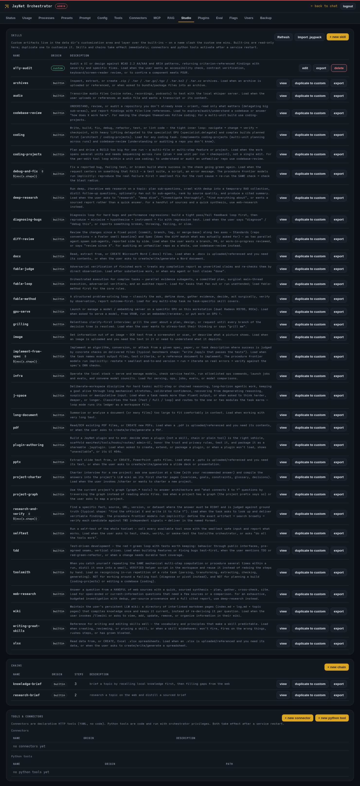

# The Studio — extend JayNet from the browser

Admin → Studio is where an admin builds new capabilities without touching the
checkout: skills, chains, API connectors and Python tools, drafted
AI-assisted if you like, validated in-place, and shareable between installs
as `.jaypack` files.

## The four artifact kinds

| Kind | What it is | When to reach for it |
|---|---|---|
| **Skill** | A Markdown document of know-how the brain loads on demand (`skills/`) | Teaching the agent a method or style — review checklists, writing rules, a domain playbook |
| **Chain** | A YAML pipeline of sub-agent + local prompt steps (`chains/`) | Fixed multi-step workflows with `{{input}}` / `{{steps.<id>.output}}` wiring |
| **Connector** | Declarative YAML HTTP tool — no code | Wrapping a REST API; credentials only as env-var references |
| **Tool** | A Python `Tool` subclass | Real logic: parsing, sandboxing, state — anything declarative can't express |

## The workflow

Each kind has an inventory table (built-ins + your customs) and an editor
with **Draft with AI**, **Validate**, **Save**:

1. **+ new …** (or open an existing row to edit/override it).
2. **Draft with AI** — the *local* model drafts the artifact, guided by the
   shipped `writing-great-skills` skill. A starting point, not a verdict.
3. **Validate** — structural checks with the errors listed under the editor
   (skill frontmatter/body, chain YAML + placeholders, connector shape, tool
   source parsing and tool-name extraction).
4. **Save** — lands in the custom layer; export any row as `.jaypack`, import
   one with **Import .jaypack**.

## The custom layer

Custom artifacts live in `$JAYNET_DATA/custom/{skills,chains,connectors,tools}`
— deliberately *outside* the checkout, so they survive `git pull` deploys and
backups pick them up ([upgrading.md](upgrading.md)). On name clash, custom
wins over the built-in of the same name: that's your override mechanism, and
deleting the custom row restores the shipped artifact.

## Trust model, honestly

- **Skills and chains** are prompt-level: they shape behavior, they can't
  escalate privileges. Chain prompt steps are local-only, so a chain can
  never smuggle data past the cloud privacy gate.
- **Connectors** are declarative HTTP; secrets enter only as env-var
  references from `~/.config/jaynet.env`, never as literals.
- **Python tools run with orchestrator privileges.** That's admin-trusted
  code by design — review what you save (and what you import) like you'd
  review a plugin. Tool edits take effect on service restart; the other
  kinds are picked up without one.

Code-level view: [architecture.md](architecture.md#notable-subsystems);
what the test suite pins down: [testing.md](testing.md#studio-registry--skills).
