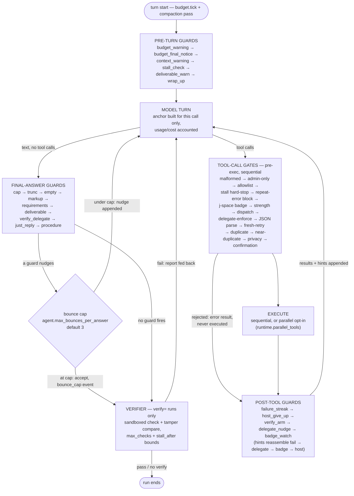

# Life of a turn

*Contributor doc — the exact execution order of one agent-loop iteration and
where each rail sits in it. Grounded in `runtime/loop.py` (`AgentRuntime.run`),
the dispatch pipeline (`runtime/dispatch_guards.py`), run-settings parsing
(`runtime/run_setup.py`) and the guard registries (`runtime/turn_guards.py`,
`runtime/final_guards.py`). The per-rail table with config keys and live-case
origins is [rails.md](rails.md) (generated).*

One `run()` iteration is: compaction pass → **pre-turn guards** → **model
turn** → either the **final-answer path** (no tool calls) or the **tool
path**. The tool path resolves every call through the **tool-call gates**
(the pre-exec `DISPATCH_GATES` pipeline in `runtime/dispatch_guards.py`),
executes the survivors, then fires the **post-tool guards** over the
results. The final-answer path iterates the **final-answer guards**,
applies the **bounce cap**, and last runs the **verifier** (only for runs
with a `verify=` check).

Notes that don't fit the diagram:

- **Registry order is load-bearing** in all three guard registries — it is
  the historical order of the inline blocks, kept so traces, hint
  concatenation and the UI are unchanged. Append new guards; never reorder
  silently (the module docstrings say the same).
- Every guard application also emits one uniform `guard_fired` event
  (`{"name", "phase", "turn"}`) in addition to its legacy events — the
  rails' fire-rate telemetry. Dispatch-gate rejections emit it too
  (`phase: "dispatch"`).
- The **tool-call gates are NOT registry guards** — they are per-call
  rejections with `continue` semantics, chained as the `DISPATCH_GATES`
  pipeline in `runtime/dispatch_guards.py` (extracted from `run()` in the
  audit #1 refactor, exact historical order kept). Their names are still
  legal `guards_off` values where telemetry exists
  (`DISPATCH_GATE_NAMES` in `runtime/turn_guards.py`).
- The **bounce cap counts per answer, not per run**: a turn with tool calls
  resets the counter (`rs.answer_bounces = 0` before the gates).
- The **verifier** is deliberately not a guard: it is a bounded retry loop
  (`agent.verify.max_checks`, `stall_after`) with its own tamper comparison
  and break semantics, so it stays inline.
- The wrap-up endgame (tools OFF for the rest of the run) is announced by
  the pre-turn `wrap_up` guard; a model that still emits tool calls on the
  wrap-up turn is cut, not re-gated.
